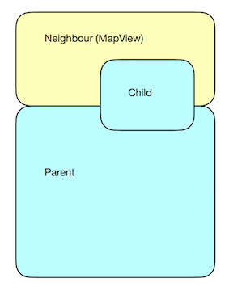
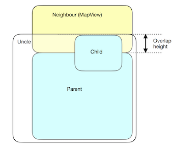

# [MO] Enable component overflow on MapView

## Owner: [Yassine Chbani](https://github.com/yassinecc)

## Motivation

It is usual to position React components in such a way that every child is rendered on top of its parent. Sometimes you want to do something out of the ordinary and let one component overflow on another that is outside its parent. It turns out that Android is quite picky with this and will not render the overflowing part on MapViews. But fear not, there is a way to get around this!

## Prerequisites

Our setup will include one child view that we want rendered on top of its MapView neighbour:




## Steps (~10 minutes)

- We start writing our basic views:

```jsx
render () {
  return (
    <Page>
      <View style={styles.neighbour}>
      </View>
      <View style={styles.parent}>
        <View style={styles.child}>
          // Your code goes here
        </View>
      </View>
    </Page>
  )
}
```

- The trick here is to introduce `uncle`, a fourth component which will host the child outside the parent. The uncle will have a negative `marginTop` value so that it overlaps with the previously rendered `neighbour` component:

```jsx
const OVERLAP_HEIGHT = 50

const styles = {
  uncle: {
    backgroundColor: 'transparent',
    marginTop: - OVERLAP_HEIGHT
  },
  child: {
    marginTop: 0
  },
  parent: {
    marginTop: OVERLAP_HEIGHT
  }
  neighbour: {
    // Another style
  }
}
```

The new layout idea is the following:



Notice how the `child` if positioned right at the top of its `uncle`. We didn't want to hide the part of `neighbour` that is at the same level as the top of the `child`, so the background color of the `uncle` is set to transparent. In `parent`'s style, we added `marginTop: OVERLAP_HEIGHT` to preserve the original vertical layout of this component with respect to `neighbour`.

- The last step is to make sure that the child will be rendered on top of the parent. The easiest way it to call the child just before the end of the `uncle`. That way you don't have to deal with `zIndex` properties:

```jsx
render () {
  return (
    <Page>
      <View style={styles.neighbour}>
      </View>
      <View style={styles.uncle}>
        <View style={styles.parent}>
          // Parent code
        </View>
        <View style={styles.child}>
          // Code of the child
        </View>
      </View>
    </Page>
  )
}
```

