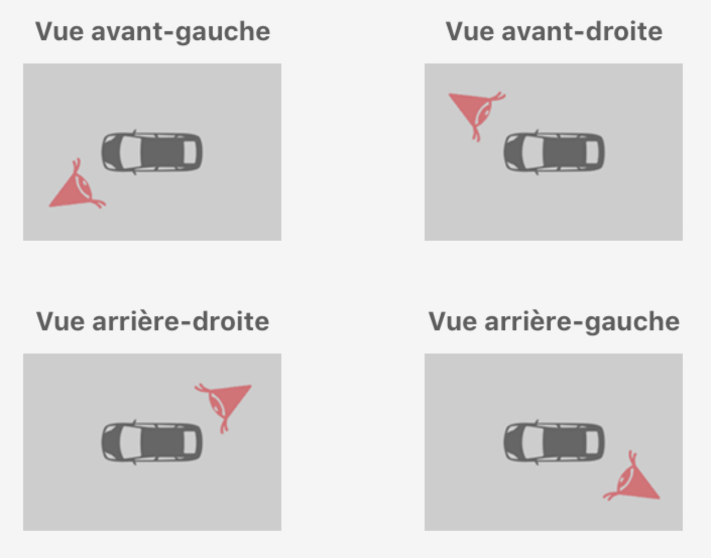
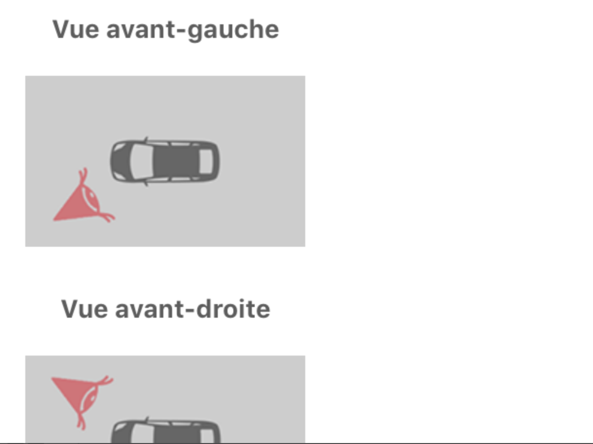

# [Standard] Good practices to resolve a ticket

## Owner: Selim BEN AMMAR

## Prerequisites

* I understand well the userStory
  * check: I know how my PO can validate it
* After reading the checklist in my ticket, I go through my code to find the files that will be modified.
* For each file, I find the part of the code that will be targeted.
* I create a git branch: git checkout -b feature—ticketNumber-ComponentName-FeatureShortDescription
* I check the quality of the actual code

## Steps (from 5 to 20min)

To make my code session as efficient as possible, I do a plan by decomposing my functionality in independent parts:
For each of those parts I write down:
1. The name of the Page/Component where I plan to do a code modification
2. The detail of the modification I will make
3. The functional test: Actions I will do in the app to make sure that it works and that it didn’t generate any bug or unexpected behavior.
4. A reminder to run project automatic tests (prettier, flow, jest…)
5. A reminder to commit the relevant modifications
6. An estimation of the time I need to finish this part.

You can use this template while planning:

| Component file   |     Modifications    | Technical tests |
|:-----------------:|:------------------:|:------------------:|
| File1.component.js |  The modification to do  |  test |
| File2.style.js | The modification to do  | test |

## Tips:
* Andon (first your architect, second your coach then other developers) as much as possible while constructing your plan.
* When the plan is finished, you HAVE to present it to a more experienced dev in order to challenge it before coding.

##  Good Examples:
### Ticket "Portfolio Creation Summary"
Ticket title: (1) As a user, in the page "Portfolio Creation Summary", when I click on the tab "In the Past", I see the graph data.
**Plan**:
- **Part 1**
  - **Goal**: Check that the graph data is already available
  - **Functional test**: use the debugger to check that this.state.backtest.composition is not an empty array
  - **Duration**: 2 minutes
- **Part 2**
  - **Goal**: Show the graph data
  - **Solution 1**: Use ul and li ---->  backtest.composition.map ((data) => li {data} /li)
  * After the architecture challenge, I changed the solution. They proposed **Solution 2** <Flatlist /> ---->

```javascript
<FlatList 
  data={backtestData.composition} 
  renderItem={({ item }) => (<Text key={data} </Text>)}  
/>
```

  - **Functional test**: display the Flatlist
  - **Automatic test + commit**
  - **Duration**: 15 minutes
- **Total Duration**: 20 minutes

## Bad Examples:
### Ticket "General Car State"
Ticket title: (2) As a user, in the page "General Car State", I see the 4 pictures of the car.

| What I expected   |     What I get without doing a plan   |
|:-----------------:|:------------------:|
| |

- **What I did**
  - Put the 4 pictures in a container view 
  - Use flex-wrap to have 2 pictures per row
- **Result**
  - As the devices in the definition of the Done had a big screen => Photos were displayed correctly
- **Unexpected result**
  - The PO tested it on an iphone 5s (small screen) and the result wasn't the same. 
  - Therefore, I had to take back this ticket to work on it again (2h of rework).
  - My coach encouraged me to use flexDirection (2 cars on a row and the 2 rows in the same column) instead of using flex-wrap. 


  
